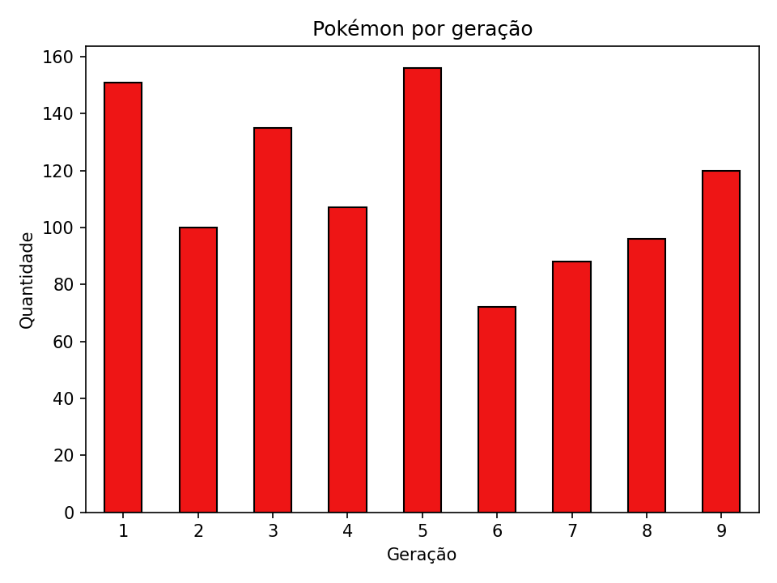

# Distribuição de Pokémon por Geração

Projeto de web scraping em Python que coleta dados de todos os Pokémon do [Pokémon Database](https://pokemondb.net/pokedex/all), classifica cada um por geração e gera um gráfico com a distribuição.

## Resultado



Os dados coletados ficam salvos em [`pokemon.csv`](pokemon.csv).

## Como funciona

1. Faz uma requisição à página `pokedex/all` do Pokémon Database.
2. Extrai número, nome, tipos e total de stats de cada Pokémon com BeautifulSoup.
3. Remove formas alternativas (Mega, Alola, etc.), mantendo só a forma base de cada número.
4. Calcula a geração pela faixa do número na Pokédex Nacional.
5. Salva o CSV e gera o gráfico de barras com a quantidade por geração.

## Tecnologias

- Python 3
- requests
- BeautifulSoup4
- pandas
- matplotlib

## Como executar

```bash
git clone https://github.com/[seu-usuario]/[nome-do-repositorio].git
cd [nome-do-repositorio]
pip install -r requirements.txt
python main.py
```

Ao final, serão gerados `pokemon.csv` e `distribuicao_geracao.png`.

## Estrutura do projeto

```
.
├── pokemon.py
├── requirements.txt
├── pokemon.csv
├── distribuicao_geracao.png
└── README.md
```

## Observações

- Os dados pertencem ao Pokémon Database e são usados aqui apenas para fins educacionais.
- O scraper faz apenas uma requisição e se identifica pelo `User-Agent`, respeitando o `robots.txt` do site.
- As faixas de geração cobrem os Pokémon #1 a #1025 (gerações 1 a 9). Novos Pokémon exigem atualizar a lista `GERACOES` no código.
